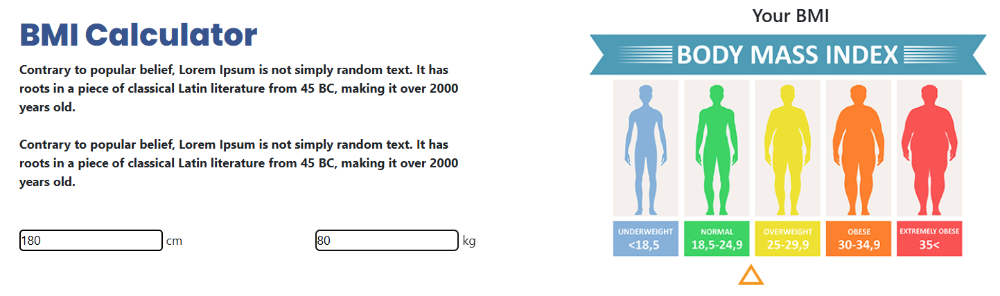

# 🏋🏽 Sport Center Website Projesi | React
- Bu proje, Patika Frontend Bootcamp'i için oluşturulan **Hafta-9 / React - Sport Center** projesidir.
* Bu proje, modern ve responsive bir fitness websitesi projesidir.
* **HTML**, **CSS**, **JavaScript** ve **React** kullanılmıştır.
* Tamamen responsive tasarıma sahiptir.
---

## :computer: Kullanım

1. Projeyi klonlayın.
```bash
git clone [proje-url]
```
2. Bağımlılıkları yükleyin.
```bash
npm install
```
3. Geliştirme sunucusunu başlatın.
```bash
npm run dev
```

---

## 📜 Sayfa Yapısı

:open_file_folder: **Klasörler;**
* *src/*
  * *components/*
    * *Navbar.jsx*
    * *Hero.jsx*
    * *CourseInfo.jsx*
    * *OurClasses.jsx*
    * *BMICalculator.jsx*
    * *Trainers.jsx*
    * *Purchase.jsx*
    * *ReviewClient.jsx*
    * *Contact.jsx*
    * *Footer.jsx*
  * *styles/*
    * *main.css*
  * *scripts/*
    * *main.js*
  * *assets/*
    * *img/*
    * *screenshots/*
  * *App.jsx*
  * *main.jsx*
* *index.html*
* *package.json*

1. ***src/components/***: React bileşenleri bu klasörde bulunur.
    1. **Navbar.jsx**: Navigasyon çubuğu ve mobil menü
    2. **Hero.jsx**: Ana karşılama bölümü
    3. **CourseInfo.jsx**: Kurs bilgileri ve istatistikler
    4. **OurClasses.jsx**: Sınıf seçenekleri ve detayları
    5. **BMICalculator.jsx**: Vücut kitle indeksi hesaplayıcı
    6. **Trainers.jsx**: Eğitmen kartları
    7. **Purchase.jsx**: Ekipman satış kartları
    8. **ReviewClient.jsx**: Müşteri yorumları
    9. **Contact.jsx**: İletişim formu ve harita
    10. **Footer.jsx**: Alt bilgi bölümü

2. ***src/styles/***: CSS dosyaları
    - **main.css**: Tüm stil tanımlamaları

3. ***src/scripts/***: JavaScript dosyaları
    - **main.js**: Temel JavaScript fonksiyonları

4. ***src/assets/***: Görseller ve medya dosyaları
    - **img/**: Proje görselleri
    - **screenshots/**: Ekran görüntüleri

---
## :star2: Özellikler

1. **Responsive Tasarım**
   - Tüm ekran boyutlarına uyumlu
   - Mobil cihazlarda özel menü tasarımı
   - Esnek grid sistemi

2. **Modern UI/UX**
   - Tam genişlikte section arkaplanları
   - Hover efektleri
   - Smooth scroll özelliği
   - Modern renk paleti

3. **İnteraktif Özellikler**
   - BMI hesaplayıcı
   - Form validasyonu
   - Dinamik menü
   - Smooth sayfa geçişleri

## 💡 Kullanılan Yapılar | Kazanımlar

**React:**
* Component-based Architecture
* Hooks (useState, useEffect)
* Props & State Management
* Event Handling
* Conditional Rendering

**HTML:**
* Semantic Tags
* Form Elements
* Responsive Images

**CSS:**
* Flexbox
* Grid
* Media Queries
* Pseudo-classes
* Custom Properties (CSS Variables)
* Transform & Transitions
* Position Properties

**JavaScript:**
* DOM Manipulation
* Event Listeners
* Form Validation
* Smooth Scroll
* Responsive Navigation

---

## :paperclip: Sayfa Çıktıları

### Web Sitesi


### Web Sitesi-2


### BMI Hesaplayıcı


### Eğitmenler
