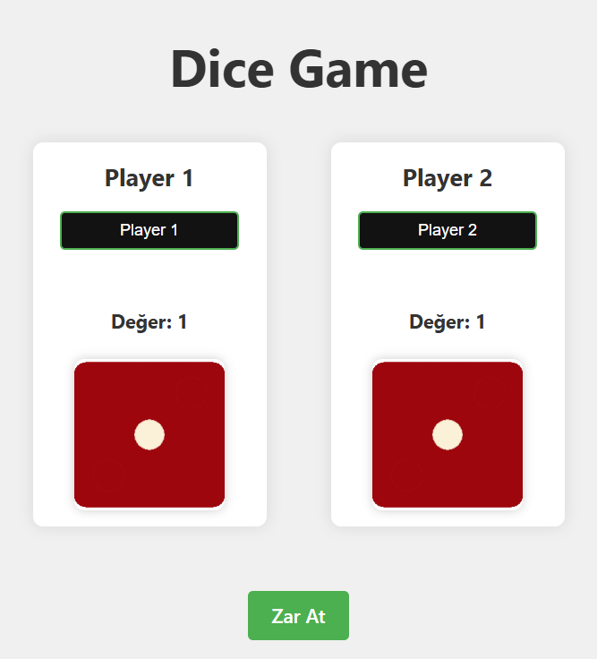
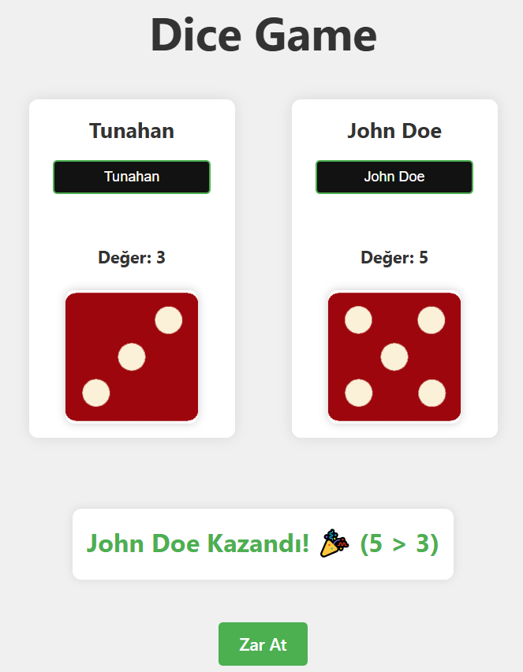

# 🎲 React Dice Game | React + Vite

İki oyunculu basit ve eğlenceli bir zar atma oyunudur. React ve Vite kullanılarak geliştirilmiştir.
* Bu proje, Patika Frontend Bootcamp'i için oluşturulan **Hafta-9 / React - Dice Game** projesidir.
* Modern ve responsive bir zar oyunu projesidir.
* **React**, **Vite**, **CSS3** ve **JavaScript** kullanılmıştır.
* Component yapısı ve Props sistemi ile geliştirilmiştir.
* Tamamen responsive tasarıma sahiptir.

---

## :computer: Kullanım

1. Projeyi klonlayın
```bash
git clone https://github.com/tunahanyasar/Hafta-9.git
```

2. Proje klasörüne gidin
```bash
cd Odev-2
```

3. Bağımlılıkları yükleyin
```bash
npm install
```

4. Geliştirme sunucusunu başlatın
```bash
npm run dev
```

---

## 📜 Proje Yapısı

:open_file_folder: **Klasörler;**
* *src/*
  * *components/*
    * *Dice.jsx*
    * *Dice.css*
    * *Player.jsx*
    * *Player.css*
    * *GameResult.jsx*
    * *GameResult.css*
  * *assets/*
    * *images/*
      * *dice1.png*
      * *dice2.png*
      * *dice3.png*
      * *dice4.png*
      * *dice5.png*
      * *dice6.png*
  * *DiceGame.jsx*
  * *DiceGame.css*
  * *App.jsx*
  * *main.jsx*
* *index.html*
* *package.json*

1. ***src/components/***: React bileşenleri bu klasörde bulunur
    * **Dice.jsx**: Tek bir zar bileşeni
    * **Player.jsx**: Oyuncu bilgileri ve zar kontrolü
    * **GameResult.jsx**: Oyun sonucu gösterimi

2. ***src/assets/images/***: Zar görselleri
    * **dice1.png - dice6.png**: Zar yüzleri

---

## :star2: Özellikler

1. **Oyun Özellikleri**
   - İki oyunculu sistem
   - Rastgele zar atma
   - Anlık sonuç gösterimi
   - Oyuncu isimlerini değiştirme
   - Zar atma animasyonu

2. **Modern UI/UX**
   - Temiz ve modern arayüz
   - Responsive tasarım
   - Animasyonlu geçişler
   - Zar atma efektleri

3. **İnteraktif Özellikler**
   - İsim değiştirme
   - Zar atma butonu
   - Sonuç gösterimi
   - Durum bildirimleri

## 💡 Kullanılan Yapılar | Kazanımlar

**React:**
* Component Mimarisi
* Props Sistemi
* State Yönetimi (useState)
* Event Handling
* Conditional Rendering

**CSS:**
* Flexbox Layout
* CSS Animations
* Transform & Transitions
* Responsive Design
* Custom Properties

**JavaScript:**
* ES6+ Özellikleri
* Array Metodları
* Zamanlayıcılar
* Rastgele Sayı Üretimi
* Event Handling

---

## :paperclip: Ekran Görüntüleri

### Oyun Başlangıcı


### Oyun Sonucu


---

## 🎮 Nasıl Oynanır?

1. Her oyuncu kendi adını girebilir.
2. "Zar At" butonuna tıklayarak zarlar atılır.
3. Zarlar animasyonlu şekilde döner.
4. Sonuç ekranda gösterilir:
   - Büyük zar atan oyuncu kazanır.
   - Eşitlik durumunda berabere.
5. Yeni tur için tekrar "Zar At" butonuna tıklanır.

---


